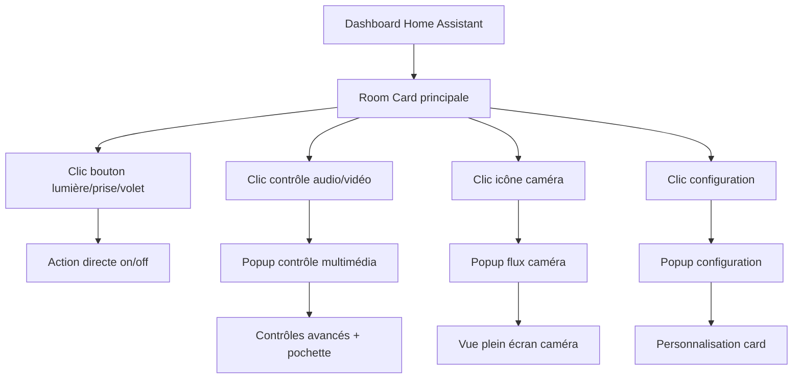

## 1. Product Overview
Custom Room Card pour Home Assistant affichant toutes les informations essentielles d'une pièce avec un design moderne et interactif.
- Résout le problème de l'affichage fragmenté des informations de pièce dans Home Assistant
- Destinée aux utilisateurs de Home Assistant souhaitant une vue consolidée et esthétique de leurs pièces
- Valeur : centralisation du contrôle et monitoring avec une expérience utilisateur optimisée

## 2. Core Features

### 2.1 User Roles
| Rôle | Méthode d'accès | Permissions principales |
|------|----------------|------------------------|
| Utilisateur Home Assistant | Connexion existante HA | Visualisation et contrôle des entités de la pièce |
| Administrateur | Accès admin HA | Configuration et personnalisation des cards |

### 2.2 Feature Module
Notre custom room card comprend les pages principales suivantes :
1. **Room Card principale** : affichage des capteurs, contrôles interactifs, design moderne
2. **Configuration popup** : paramètres personnalisables pour chaque type d'entité
3. **Media popup** : contrôle multimédia avec affichage des pochettes

### 2.3 Page Details

| Page Name | Module Name | Feature description |
|-----------|-------------|---------------------|
| Room Card principale | Section capteurs | Affiche température, humidité, consommation électrique avec chips colorés et icônes |
| Room Card principale | Section présence | Affiche le statut de présence avec indicateurs visuels animés |
| Room Card principale | Section ouvertures | Montre l'état des portes/fenêtres avec icônes dynamiques |
| Room Card principale | Section lumières | Contrôle interactif des lumières avec boutons on/off et dimmers |
| Room Card principale | Section prises | Contrôle des prises électriques avec indicateurs d'état |
| Room Card principale | Section volets | Contrôle des volets roulants avec boutons up/down/stop |
| Room Card principale | Section audio | Contrôle audio avec volume, play/pause, source |
| Room Card principale | Section vidéo | Contrôle vidéo avec lecteur intégré et commandes |
| Room Card principale | Section caméras | Affichage des flux caméra avec snapshots |
| Configuration popup | Paramètres card | Personnalisation des couleurs, tailles, comportements |
| Media popup | Contrôle multimédia | Affichage des pochettes, métadonnées, contrôles avancés |

## 3. Core Process

### User Flow principal
1. L'utilisateur accède au dashboard Home Assistant
2. La room card affiche automatiquement l'état de toutes les entités
3. L'utilisateur interagit avec les boutons pour contrôler les devices
4. Les popups s'ouvrent pour les contrôles détaillés ou la configuration
5. Les changements d'état se reflètent en temps réel sur la card

### Admin Flow
1. L'admin configure les entités à afficher via le popup de configuration
2. Personnalisation des couleurs et styles selon les préférences
3. Sauvegarde des paramètres pour persistence

## 4. User Interface Design

### 4.1 Design Style
- **Couleurs primaires** : Dégradés bleu-violet (#667eea → #764ba2)
- **Couleurs secondaires** : Gris moderne (#f7fafc → #e2e8f0)
- **Style boutons** : Arrondis avec ombres douces et effets hover
- **Polices** : Inter ou Roboto, tailles 12px-18px
- **Layout** : Card-based avec grille responsive, sections organisées
- **Icônes** : Material Design Icons avec animations subtiles
- **Animations** : Transitions fluides, micro-interactions

### 4.2 Page Design Overview

| Page Name | Module Name | UI Elements |
|-----------|-------------|-------------|
| Room Card principale | Section capteurs | Chips avec dégradés, icônes SVG, valeurs en temps réel, animations de changement |
| Room Card principale | Section contrôles | Boutons arrondis avec états, effets de pression, couleurs dynamiques selon état |
| Room Card principale | Section médias | Images de couverture avec overlay, contrôles flottants, métadonnées stylisées |
| Configuration popup | Interface config | Sliders, color pickers, toggles, aperçu temps réel |
| Media popup | Lecteur multimédia | Pochette album arrondie, barre progression, contrôles modernes |

### 4.3 Responsiveness
- Desktop-first avec adaptation mobile
- Optimisation touch pour mobile
- Grille responsive : 4 colonnes desktop, 2 tablette, 1 mobile
- Tailles de police adaptatives
- Espacement flexible selon écran