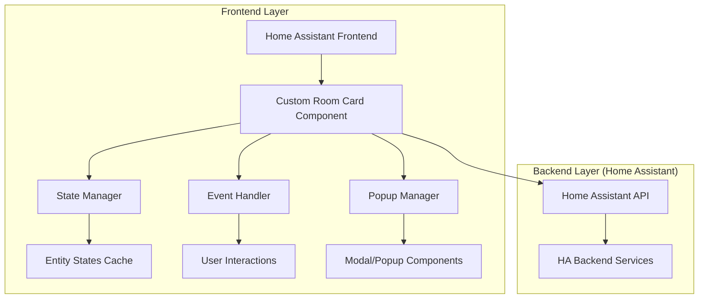
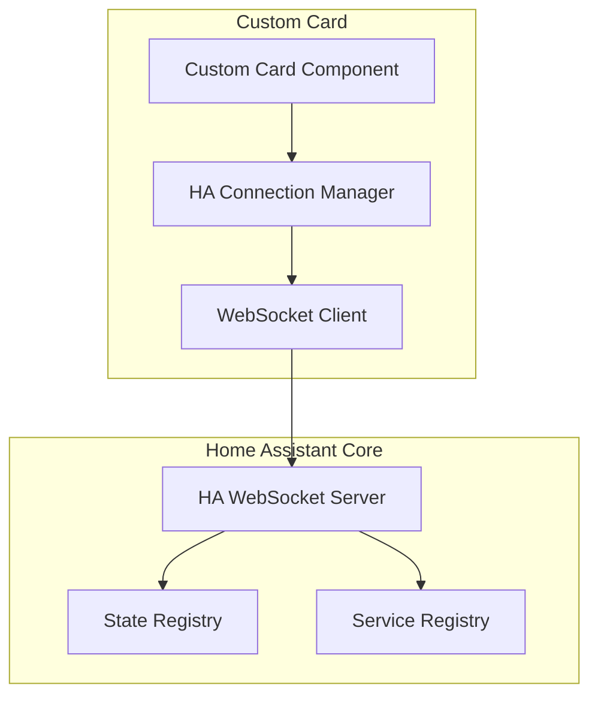
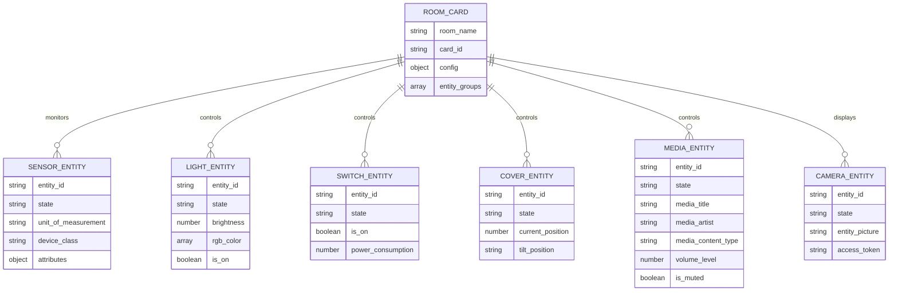

## 1.Architecture design



## 2.Technology Description
- Frontend: Custom Lovelace Card (JavaScript/TypeScript + Lit Element)
- Backend: Home Assistant Core (Python)
- Communication: WebSocket API de Home Assistant
- Styling: CSS3 avec variables CSS pour thématisation
- Icons: Material Design Icons via HA

## 3.Route definitions
| Route | Purpose |
|-------|---------|
| /hacsfiles/ha-room-card/ha-room-card.js | Fichier principal de la custom card |
| /local/ha-room-card/ | Configuration locale des assets |
| /api/states | Récupération des états des entités |
| /api/services | Appel des services HA pour les contrôles |

## 4.API definitions

### 4.1 Core API Home Assistant

**Récupération des états d'entités**
```
GET /api/states
```

Response:
| Param Name| Param Type  | Description |
|-----------|-------------|-------------|
| entity_id | string      | Identifiant unique de l'entité |
| state     | string      | État actuel de l'entité |
| attributes| object      | Attributs supplémentaires (unité, icône, etc.) |
| last_changed| string    | Timestamp du dernier changement |

**Appel de services**
```
POST /api/services/<domain>/<service>
```

Request:
| Param Name| Param Type  | isRequired  | Description |
|-----------|-------------|-------------|-------------|
| entity_id | string      | true        | Entité cible du service |
| service_data| object    | false       | Paramètres additionnels |

Example
```json
{
  "entity_id": "light.salon",
  "rgb_color": [255, 0, 0],
  "brightness": 255
}
```

### 4.2 WebSocket Events

**Subscription aux changements d'état**
```
{
  "type": "subscribe_states",
  "entity_ids": ["sensor.temperature_salon", "light.salon"]
}
```

**Event de changement d'état**
```
{
  "type": "state_changed",
  "data": {
    "entity_id": "light.salon",
    "new_state": {...},
    "old_state": {...}
  }
}
```

## 5.Server architecture diagram



## 6.Data model

### 6.1 Data model definition



### 6.2 Data Definition Language

**Configuration de la card (dans configuration.yaml)**
```yaml
ha-room-card:
  type: custom:ha-room-card
  room_name: "Salon"
  entities:
    temperature:
      entity_id: sensor.temperature_salon
      icon: mdi:thermometer
      unit: "°C"
    humidity:
      entity_id: sensor.humidity_salon
      icon: mdi:water-percent
      unit: "%"
    power:
      entity_id: sensor.power_consumption_salon
      icon: mdi:flash
      unit: "W"
    presence:
      entity_id: binary_sensor.presence_salon
      icon: mdi:motion-sensor
    lights:
      - entity_id: light.salon_principal
        name: "Plafonnier"
      - entity_id: light.salon_ampoule
        name: "Lampe d'appoint"
    switches:
      - entity_id: switch.prise_salon_tv
        name: "TV"
      - entity_id: switch.prise_salon_console
        name: "Console"
    covers:
      - entity_id: cover.volet_salon
        name: "Volet"
    media:
      - entity_id: media_player.salon_speaker
        name: "Enceinte"
        type: "audio"
      - entity_id: media_player.salon_tv
        name: "TV"
        type: "video"
    cameras:
      - entity_id: camera.salon
        name: "Caméra Salon"
  design:
    primary_color: "#667eea"
    secondary_color: "#764ba2"
    card_style: "gradient"
    show_labels: true
    compact_mode: false
```

**Variables CSS pour thématisation**
```css
:root {
  --ha-room-primary-color: #667eea;
  --ha-room-secondary-color: #764ba2;
  --ha-room-background: linear-gradient(135deg, var(--ha-room-primary-color), var(--ha-room-secondary-color));
  --ha-room-card-border-radius: 16px;
  --ha-room-chip-border-radius: 20px;
  --ha-room-button-size: 48px;
  --ha-room-spacing: 12px;
}
```