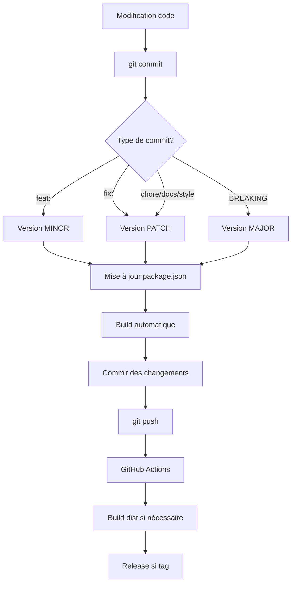

# ✅ Système de Versionnement Automatique - RÉSUMÉ

## 🎯 Configuration Terminée

Le projet HA Room Card est maintenant équipé d'un système de versionnement sémantique **entièrement automatisé** !

## 🚀 Fonctionnalités Implémentées

### **1. Versionnement Automatique**
- ✅ **Détection du type de commit** : feat, fix, BREAKING CHANGE, chore, docs, style
- ✅ **Incrémentation sémantique** : Major.Minor.Patch
- ✅ **Mise à jour automatique** : package.json, const.ts, README.md, CHANGELOG.md

### **2. Build Automatique**
- ✅ **Hook Git pre-commit** : Vérification + build + version
- ✅ **GitHub Actions** : Build sur chaque push
- ✅ **Scripts npm** : version, version-tag, build-and-commit, release

### **3. Release Automatique**
- ✅ **Tags Git** : Création automatique sur demande
- ✅ **Releases GitHub** : Génération avec changelog
- ✅ **Intégration HACS** : Mise à jour automatique des infos

## 📝 Utilisation Quotidienne

### **Pour les développeurs**

```bash
# 1. Travailler sur le code
vim src/ha-room-card.ts

# 2. Commiter (automatique)
git add .
git commit -m "feat: ajouter une nouvelle fonctionnalité"
# → Version automatiquement: 1.1.0 → 1.2.0
# → Build automatique du dist/
# → Commit automatique des changements

# 3. Push (build automatique)
git push
# → GitHub Actions build le dist si nécessaire
```

### **Pour les releases**

```bash
# Release complète en une commande
npm run release
# → Version + Tag + Build + Push + Release GitHub
```

## 🏷️ Règles de Versionnement

| Type de commit | Format | Exemple | Résultat |
|---------------|---------|----------|----------|
| **Nouvelle fonctionnalité** | `feat:` | `feat: éditeur visuel` | **MINOR** (1.1.0 → 1.2.0) |
| **Correction de bug** | `fix:` | `fix: crash température` | **PATCH** (1.2.0 → 1.2.1) |
| **Changement cassant** | `!` ou `BREAKING CHANGE` | `feat: nouvelle API!` | **MAJOR** (1.2.1 → 2.0.0) |
| **Maintenance** | `chore:`, `docs:`, `style:` | `chore: mise à jour deps` | **PATCH** (1.2.1 → 1.2.2) |

## 🔄 Workflow Complet



## 📦 Fichiers Gérés

### **Automatiquement mis à jour**
- ✅ `package.json` - Version principale
- ✅ `src/const.ts` - Version dans le code
- ✅ `README.md` - Documentation
- ✅ `CHANGELOG.md` - Historique
- ✅ `hacs-repository-info.json` - Infos HACS

### **Générés automatiquement**
- ✅ `dist/ha-room-card.js` - Build principal
- ✅ `dist/ha-room-card-schema.json` - Schéma éditeur
- ✅ `dist/**/*.d.ts` - Définitions TypeScript

## 🎯 Avantages

### **Pour les développeurs**
- 🚀 **Rapidité** : Plus besoin de gérer les versions manuellement
- 🔄 **Consistance** : Versionnement toujours cohérent
- 📝 **Clarté** : Conventional commits standardisés
- 🤖 **Automatisation** : Moins d'erreurs humaines

### **Pour les utilisateurs**
- 📦 **Releases propres** : Changelogs générés automatiquement
- 🏷️ **Tags clairs** : Numéros de version sémantiques
- 📥 **HACS synchronisé** : Toujours la dernière version

### **Pour le projet**
- 📊 **Traçabilité** : Historique complet des versions
- 🔧 **Maintenance** : Mises à jour simplifiées
- 🚀 **Déploiement** : Releases automatisées et fiables

## 🎉 Résultat Final

Le système garantit :
- ✅ **Versionnement automatique** à chaque commit
- ✅ **Build synchronisé** avec le code source  
- ✅ **Release professionnelle** avec changelog
- ✅ **Compatibilité HACS** maintenue
- ✅ **Développement simplifié** et accéléré

**Le projet est maintenant prêt pour un développement professionnel avec versionnement entièrement automatisé !** 🚀